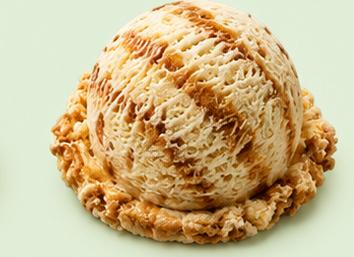

# VV2 Stone Cold Ice Creams — Website Guide
### A complete reference for building, customising, and learning from this project

---

## FOLDER STRUCTURE

```
VV2-IceCream/
├── index.html          → Home page
├── products.html       → Full menu with tabs
├── about.html          → About Us + story
├── reviews.html        → Customer reviews
├── contact.html        → Enquiry form + map
│
├── css/
│   ├── style.css       → All styling (colors, layout, animations)
│   └── icons.css       → Icon sizing helpers
│
├── js/
│   └── main.js         → All interactivity (tabs, carousel, form, etc.)
│
└── images/
    ├── icons.svg       → All custom SVG vector icons (sprite)
    │
    ├── hero-bg.mp4     ← PASTE YOUR VIDEO HERE
    ├── hero-poster.jpg ← Fallback thumbnail for the video
    │
    ├── gallery-1.jpg   ← Gallery slide 1
    ├── gallery-2.jpg   ← Gallery slide 2
    ├── gallery-3.jpg   ← Gallery slide 3
    ├── gallery-4.jpg   ← Gallery slide 4
    ├── gallery-5.jpg   ← Gallery slide 5
    ├── gallery-6.jpg   ← Gallery slide 6
    │
    ├── scoop-strawberry.jpg
    ├── scoop-fig-honey.jpg
    ├── scoop-passion-fruit.jpg
    ├── scoop-harvest-mango.jpg
    ├── scoop-chikoo.jpg
    ├── scoop-blueberry.jpg
    ├── scoop-alphonso.jpg
    ├── scoop-pineapple.jpg
    ├── scoop-tender-coconut.jpg
    ├── scoop-jackfruit.jpg
    ├── scoop-very-berry.jpg
    ├── scoop-sitaphal.jpg
    ├── scoop-lotus-biscoff.jpg
    ├── scoop-triple-chocolate.jpg
    ├── scoop-classic-vanilla.jpg
    ├── scoop-butterscotch.jpg
    │
    ├── stick-fruit-bar.jpg
    ├── stick-milk-bar.jpg
    ├── stick-kulfi-bar.jpg
    ├── stick-chilly-mango.jpg
    ├── stick-strawberry-bar.jpg
    ├── stick-coconut-kulfi.jpg
    ├── br-rock.jpg
    │
    ├── mango-in-mango.jpg
    ├── strawberry-in-strawberry.jpg
    ├── fruit-float.jpg
    ├── milkshake.jpg
    ├── fruit-cream-sundae.jpg
    ├── mini-falooda.jpg
    ├── brownie-sundae.jpg
    ├── croissant-cone.jpg
    ├── hot-puff.jpg
    ├── pastry-ice-cream.jpg
    ├── waffles.jpg
    ├── roll-cake.jpg
    ├── cheesecake.jpg
    ├── pastries.jpg
    │
    ├── about-store.jpg     ← Your store or team photo
    ├── favicon.png         ← Your logo icon (32x32 or 64x64)
    └── logo.png            ← Full logo (any size, used in navbar)
```

---

## STEP 1 — OPEN THE WEBSITE

1. Download or move the entire `VV2-IceCream/` folder to your computer
2. Open the folder in VS Code (right-click the folder > Open with VS Code)
3. Install the **Live Server** extension in VS Code
4. Right-click `index.html` > **Open with Live Server**
5. The website opens in your browser at `http://127.0.0.1:5500`

You do NOT need any special software, server, or internet to run this locally.

---

## STEP 2 — ADD YOUR IMAGES

All product images follow a simple naming pattern. You just paste photos into the `images/` folder with the exact filename.

### How images work in the code
```html

<div class="product-img-placeholder" style="display:none;">🍓</div>
```

The `onerror` part means: if the image file is missing, automatically show the SVG placeholder instead. So the website always looks good even if you haven't added all photos yet.

### Image size recommendations
- Product cards: 600 x 600 px (square)
- Gallery slides: 800 x 600 px
- About store photo: 600 x 750 px
- Hero video poster: 1920 x 1080 px
- Logo: 200 x 60 px (PNG with transparent background)
- Favicon: 64 x 64 px

### How to compress images (important for speed)
Use squoosh.app — free, online, no install needed. Compress to under 150KB per image.

---

## STEP 3 — ADD YOUR HERO VIDEO

1. Get a slow-motion food video (your own, or from a site like Pexels.com — search "ice cream")
2. Save it as `hero-bg.mp4` in the `images/` folder
3. Also save a screenshot/thumbnail of the video as `hero-poster.jpg`

The JavaScript already sets the video to play at 0.55x speed (slow motion effect):
```js
heroVideo.playbackRate = 0.55;
```

If no video loads, the fallback pink-to-purple gradient shows automatically.

### Video file size tip
Keep the video under 8MB. Use HandBrake (free app) to compress — set quality to RF 28 and resolution to 1280x720.

---

## STEP 4 — UPDATE CONTACT DETAILS

In `js/main.js` line 7:
```js
const PHONE = '919884964132';
```
Replace `919884964132` with the actual WhatsApp number (country code + number, no + sign, no spaces).

---

## STEP 5 — EMBED GOOGLE MAPS

In `contact.html`, find this section:
```html
<iframe
  src="https://www.google.com/maps/embed?pb=..."
```

To get your real embed link:
1. Go to google.com/maps
2. Search for "Old No.24 New No.30 Balfour Road Kilpauk Chennai"
3. Click the **Share** button
4. Click **Embed a map**
5. Copy the `src="..."` URL only
6. Paste it replacing the current src value in `contact.html`

---

## STEP 6 — ADD MORE PRODUCTS

To add a new product card, copy this block and paste inside any `.products-grid`:

```html
<div class="product-card fade-in">
  <div class="product-img-wrap">
    
    <div class="product-img-placeholder" style="display:none;">
      <!-- SVG icon goes here -->
      <svg width="48" height="48" viewBox="0 0 48 48" fill="var(--pink)">
        <use href="images/icons.svg#icon-scoop"/>
      </svg>
    </div>
    <span class="product-badge">New</span>
  </div>
  <div class="product-info">
    <div class="product-name">Your Product Name</div>
    <div class="product-desc">Short description of the product</div>
    <div class="product-footer">
      <div class="product-price">₹99 <small>per unit</small></div>
      <button class="product-order-btn">Order</button>
    </div>
  </div>
</div>
```

---

## STEP 7 — CUSTOMISE COLORS

All colors are CSS variables in `css/style.css`. Change them in one place and the whole website updates:

```css
:root {
  --pink:        #E8177A;   /* Main brand pink */
  --purple:      #6B1FA0;   /* Mercely's purple */
  --orange:      #FF7B00;   /* Accent color */
  --cream:       #FFF8F0;   /* Background */
  --dark:        #1A0A00;   /* Text color */
}
```

---

## STEP 8 — ADD MORE REVIEWS

In `reviews.html`, copy this block and paste inside `#reviewsGrid`:

```html
<div class="review-card fade-in" data-category="wedding">
  <!-- data-category options: wedding, corporate, birthday, bharaat -->

  <div class="review-stars">
    <!-- 5 stars: copy the SVG star 5 times -->
    <svg width="18" height="18" viewBox="0 0 48 48" style="fill:var(--orange);display:inline;">
      <use href="images/icons.svg#icon-star"/>
    </svg>
  </div>

  <div class="review-text">
    Customer's review text goes here...
  </div>

  <div class="review-author">
    <div class="review-avatar">A</div>  <!-- First letter of name -->
    <div class="review-author-info">
      <div class="name">Customer Name</div>
      <div class="event">Event Type · Location</div>
    </div>
  </div>

</div>
```

---

## STEP 9 — DEPLOY THE WEBSITE (Make it live online)

### Option A: Netlify (Free, Easiest — Recommended)
1. Go to netlify.com and create a free account
2. Drag and drop your entire `VV2-IceCream/` folder onto the Netlify dashboard
3. It gives you a live URL like `vv2-icecream.netlify.app` instantly
4. To use a custom domain (like `vv2stonecold.com`), buy it from GoDaddy and link it in Netlify settings

### Option B: GitHub Pages (Free)
1. Create a GitHub account
2. Create a new repository called `VV2-IceCream`
3. Upload all files
4. Go to Settings > Pages > Select main branch
5. Live at `yourusername.github.io/VV2-IceCream`

---

## WHAT YOU LEARNED BUILDING THIS

This project covers all the core basics of web development:

### HTML (Structure)
- `<!DOCTYPE html>` — tells the browser this is an HTML5 document
- `<head>` — invisible metadata (title, CSS links, fonts)
- `<body>` — everything visible on screen
- Semantic tags: `<nav>`, `<section>`, `<footer>`, `<h1>`–`<h3>`, `<p>`, `<a>`, ``
- `<form>` and form elements: `<input>`, `<select>`, `<textarea>`, `<button>`
- Accessibility: `alt` text on images, `aria-label` on buttons

### CSS (Style)
- CSS variables (`--pink`, `--purple`) — design tokens
- Flexbox — `display:flex`, `justify-content`, `align-items`, `gap`
- CSS Grid — `display:grid`, `grid-template-columns`, `auto-fit`, `minmax()`
- Media queries — `@media (max-width: 600px)` for mobile responsiveness
- Animations — `@keyframes`, `animation`, `transition`
- Pseudo-elements — `::before`, `::after` for decorative lines
- `:hover` states for interactivity

### JavaScript (Interactivity)
- `document.querySelector()` — selecting HTML elements
- `addEventListener('click', ...)` — responding to user actions
- `classList.add/remove/toggle()` — changing CSS classes from JS
- `IntersectionObserver` — detecting when elements scroll into view
- `setInterval` / `clearInterval` — auto-playing the carousel
- `window.open()` — opening WhatsApp links
- Form `event.preventDefault()` — stopping default form submit

### SVG (Vector Graphics)
- `<symbol>` and `<use>` — reusable SVG sprite system
- `viewBox` — SVG coordinate system
- `currentColor` — SVG color that inherits from CSS
- `fill`, `stroke`, `opacity` — SVG styling properties

---

## QUICK REFERENCE: SVG ICONS AVAILABLE

All icons are in `images/icons.svg`. Use them like this:
```html
<svg width="24" height="24" viewBox="0 0 48 48" fill="var(--pink)">
  <use href="images/icons.svg#ICON-NAME"/>
</svg>
```

Available icon names:
- `#icon-scoop` — ice cream scoop
- `#icon-stick` — ice cream bar
- `#icon-milkshake` — milkshake glass
- `#icon-sundae` — waffle cone sundae
- `#icon-cake` — celebration cake
- `#icon-strawberry` — strawberry
- `#icon-mango` — mango
- `#icon-coconut` — coconut
- `#icon-berry` — berries
- `#icon-chocolate` — chocolate bar
- `#icon-cookie` — cookie / Biscoff
- `#icon-waffle` — waffle
- `#icon-cheesecake` — cheesecake slice
- `#icon-falooda` — falooda glass
- `#icon-brownie` — brownie
- `#icon-croissant` — croissant
- `#icon-puff` — puff pastry
- `#icon-leaf` — vegetarian leaf
- `#icon-star` — filled star
- `#icon-star-outline` — empty star
- `#icon-phone` — phone
- `#icon-location` — location pin
- `#icon-mail` — envelope
- `#icon-clock` — clock
- `#icon-trophy` — trophy
- `#icon-calendar` — calendar
- `#icon-people` — group of people
- `#icon-milk` — milk bottle
- `#icon-heart` — heart
- `#icon-check` — checkmark circle
- `#icon-send` — send arrow
- `#icon-arrow-right` — right arrow
- `#icon-scroll-down` — scroll indicator
- `#icon-menu` — hamburger menu
- `#icon-close` — X close
- `#icon-instagram` — Instagram logo
- `#icon-facebook` — Facebook logo
- `#icon-whatsapp` — WhatsApp logo
- `#icon-quote` — quote marks
- `#icon-veg` — vegetarian dot
- `#icon-badge` — award badge

---

## COMMON MISTAKES TO AVOID

1. Image filename must match exactly — `scoop-strawberry.jpg` is different from `Scoop-Strawberry.jpg`
2. All files must stay inside the `VV2-IceCream/` folder — do not move `css/`, `js/`, or `images/` outside
3. Never delete `icons.svg` — every icon in the website depends on it
4. If you add a new HTML page, copy the `<nav>`, `<footer>`, and `<div class="whatsapp-float">` blocks from an existing page
5. Always add `<script src="js/main.js"></script>` before `</body>` on every page

---

*VV2 Stone Cold Ice Creams · Built clean, built to last.*
